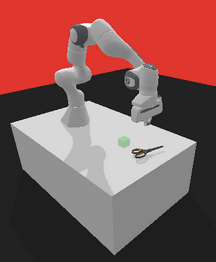

# 3D Vision Based Grasping:

<p align="center"></p>

This project explores how 3D Point Clouds can be used to train learning-based grasping algorithm. This project is built on panda-sym, rl-baselines3-zoo, and the YCB dataset.

## Installation

From source:
```
pip install -r requirements.txt
```

If objects are not appearing in `data/object2urdf/examples/ycb_assets`, generate new objects with object2urdf found here: https://github.com/harvard-microrobotics/object2urdf

## Train using this Sim

Training with a custom enviorment can be done by changing either the `final/final_env.py` and `final/final_task.py` to train with Pandas-Gym or `final/rl_zoo_env.py` and `final/rl_zoo_task.py`. 

An agent can be trained using with rl_zoo_env.py the following command from the root of the project

```
python rl-baselines3-zoo/train.py --algo {algorithm} --env MyPandaEnv-v0 --n-timesteps {timesteps} -P
```

Training a custom policy can be done by editting `final/policy.py` and `rl-baselines3-zoo/rl_zoo3/policy.py` and editting the hyperparameters in `rl-baselines3-zoo/hyperparams/sac.yml` under MyPandaEnv-v0

The URDF files are in `data/object2urdf/examples/ycb_assets/`. A script to generate .urdf files from .obj files is from https://github.com/harvard-microrobotics/object2urdf

The hyperparameters for each environment are defined in `hyperparameters/algo_name.yml`.

## Project Report
For more information about this project, reference `Report_Final_Paper.pdf`

## Citing the Project

To cite this repository in publications:

```bibtex
@misc{3D-Vision-Grasping,
  author = {Juneja, Sahen},
  title = {3D Vision Based Grapsing},
  year = {2026},
  publisher = {GitHub},
  journal = {GitHub repository},
  howpublished = {\url{https://github.com/SJuneja0/3D-Vision-Based-Grasping.git}},
}
```